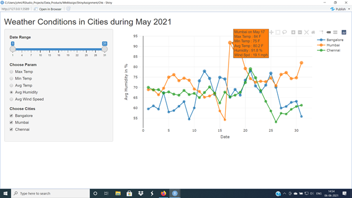

```{r setup, include=FALSE}
knitr::opts_chunk$set(echo = FALSE)
```

## Overview

The App displays the weather conditions that were prevailing in the 3 cities, Bangalore, Mumbai and Chennai during the month of May 2021.

The parameters available are Max, Min and Average temperature, average Humidity and average Wind Speed which are displayed in the graph as per the users selections.

## User Friendly

- Date Range modification through slide bar, no need of date entry through keyboard
- Choice of plotting parameters through Radio Buttons
- Single city or a combination of cities can be selected using the check boxes
- Link to User Documentation present in the web page
- Plots colours are pleasing to the eyes
- Non plotted parameters can also be viewed for each point by hovering over the point of interest

## View of Web Page



## THANK YOU!


**Please do visit the Web Page at https://jol2kor.shinyapps.io/WeatherHistory/**


